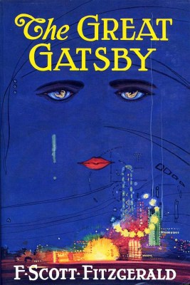

When people are told not to do something, the likelihood is that they are going to do the opposite. So when you have been told to never judge a book by its cover chances are that you have.

That is the reason for a front cover in the first place! Readers are meant to judge if a book is suitable for them and a front cover should reveal the answers. Successful covers aim at the books target audience while also revealing the genre and concept of a title. 

I have listed three well-known books that have had both successful and unsuccessful book covers tied to the same title to encompass what factors make for a good book cover.

**1. Roald Dahl’s Charlie and the Chocolate Factory**

That doll’s face perfectly encapsulates my own facial expression when I saw that iteration of Charlie and the Chocolate Factory. There is no correlation between the story and the cover, either revealing that the designer didn’t do their research or was not briefed on the concept of the book. The purpose of a front cover is to convey the visual story of the writing inside, to which this was done poorly. The right cover also does not suit the target audience, whereas the left cover is jovial, illustrated and the messy handwritten font conveys that this title is aimed at children. The left cover also portrays the genre effectively, suggesting that the book is a work of fiction.

**2. F. Scott Fitzgerald’s The Great Gatsby**

The left cover is one of the most recognizable covers of The Great Gatsby book covers, however, the newer iteration on the right provides more meaning and seamlessness when it comes to the themes of the story. The book cover on the right features a conceptual illustration denoting the disparity between the social classes and the cost of pursuing the American Dream during the roaring twenties. The font on the right book is synonymous to 1920s typography.

Despite the downside to the left cover, it does have an electric blue backdrop which is eye-catching particularly from a distance. Ideal for selling to a reader online or perfect for displaying in a bookshop window.

Although there have been many versions of the left cover of Daisy Buchanan’s face in the sky, this particular cover, however, does not feature the best composition and the right cover makes better use of the space.

**3. Herman Melville’s Moby Dick or The Whale**

Marine biology is clearly not someone’s strong suit, but this cover exudes laziness on a whole other level. It reveals nothing about the target audience, genre, and definitely does not portray the visual story. On the contrary, the detailed illustration on the left connotes Moby Dick is a classic novel that deserves more than a stock photo of a shark! The connotations of the colour red suggest danger which ties in with the stormy sea and reveals the themes of the story. The framing of the illustration along with the typography allows for the title to be readable and once again eye-catching.

All of these titles have had various iterations but hopefully, after this blog post, you are all able to recognise a good book cover from a bad one. As for the small population of readers who have never judged a book by its cover, rest assured that you have now!