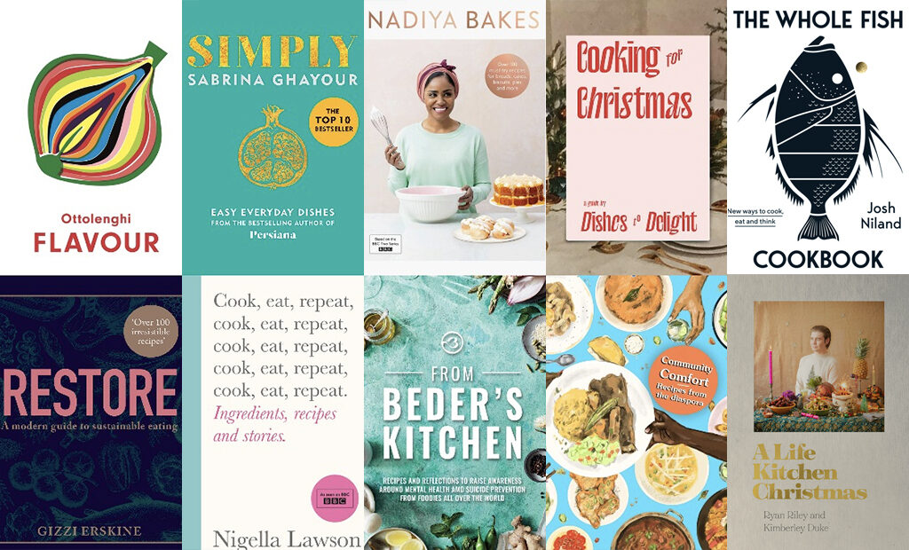

I do not have much flair when it comes to winging it in the kitchen and need to have a step by step method when attempting to venture further into the cooking realm, any recipe that takes me away from my go-to delicacy of cheese on toast needs to hold my hand every step of the way. Personally, my mum does not give me her cooking tips and the fact that I currently don’t live with her makes it harder for her to describe what I need to do over FaceTime. 

However, many established cooks and bakers have traditional recipes passed down from generation to generation, encompassing their star dish. Some people do have a flair in the kitchen though, and love to experiment with new flavours. For example, take the Walkers Cheese and Onion flavour invented by Joe Spud that has become a recognisable crisp flavour in the Walkers franchise! With experiments come accidents and many recipes are also made unintentionally.

Speaking of flair, many professionals are highly influential in creating trends within the cooking scene, Nigella and Ottolenghi, just to name a few. Their cookbooks dominate the charts, but they do not only inspire the amateur that is you or me. They also encourage recipe developers in chain supermarkets such as Sainsbury’s. There is a sense of ease when taking a recipe from a professional chef because it makes you think that the time you put into creating the food will be worth it and is guaranteed to taste nice because the professional said so. For the supermarket recipe developers, they just want to make some money. 

Yet, in my opinion, YouTubers are my preferred method of finding a new recipe. Being a Gen Z, having a digital recipe is imperative as my life is made simple by content that gives quick gratification. Not to mention, free content is highly desirable for a student who is on a budget. YouTube has an array of videos and assures an amateur cook, like me, the mixture is meant to look a bit brown and unappetising. 

<iframe width="560" height="315" src="https://www.youtube.com/embed/watch?v=JzJsUW4xV7k?rel=0" allow="accelerometer; autoplay; encrypted-media; gyroscope; picture-in-picture" allowfullscreen></iframe>

Lastly, websites are also hugely popular for finding recipes from the [BBC Good Food](https://www.bbcgoodfood.com/recipes) website or [Pinch of Nom](https://pinchofnom.com/recipes/). This is usually another go-to method for me, and they are typically packed with useful tips and tricks to help make your life easier. 

Whether you are searching the web, reading your favourite cookbook, or even gaining some confidence to see what you can whip up on your own, recipes are continually being rediscovered, created, and thrown away with the times. They are all developed to suit your cravings. But just know that usually, your mixture should never look *that* brown...