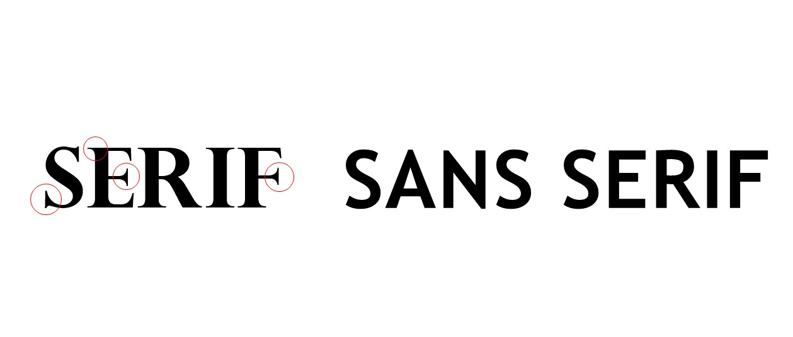
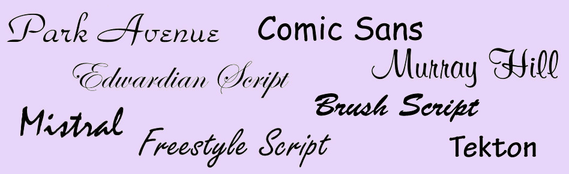
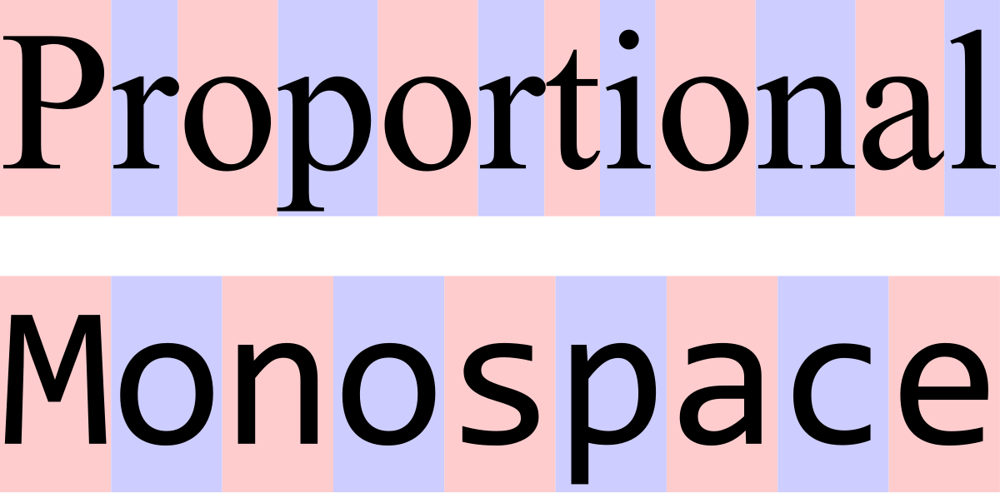
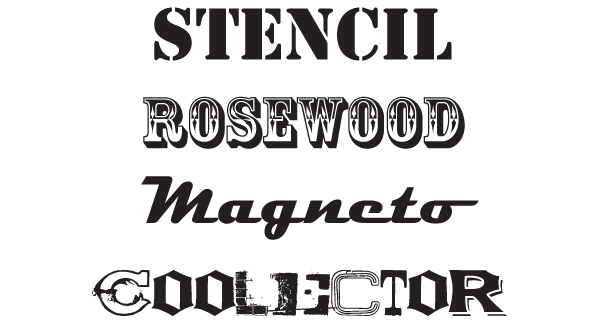

I am a sucker for fonts, but why does it take so long to find the right font for the project you are creating? There are millions of typefaces to choose from, all bearing peculiar names. But what if I told you that there are five primary classifications of typeface generated for various purposes to suit any project you are designing. It won't necessarily save you time deciding, but this blog post will teach you which ones are suitable for each aspect of a project. Different fonts can evoke different feelings in a project, and knowing the specific characteristics that set these styles apart from one another is valuable knowledge for any designer so let's break it down one by one:

1. **Serif - ideal for body copy or headlines, including titles and logos.**
   Serifs include slight projections that finish off their letterforms' strokes, called 'serifs' hence the appropriate name and date back as far as the 1500s! The Serif typeface is sectioned into old style, transitional, modern, slab serif, and glyphic serifs. It is interesting to compare each style to one another and see how the design allows each font to emulate something different. Yet also realise that they all share the same fundamental features of having a serif.

   
2. **Sans serif - ideal for body copy or headlines, including titles and logos.**
   Early sans serif typefaces were called grotesque or gothic fonts and included typefaces like Franklin Gothic. They were named 'grotesque' because the style was the opposite of the more 'elegant' serif design elements. After the Grotesques came to the Neo-Grotesque sans serif typefaces, these typefaces were designed to be more legible than their earlier counterparts and generally have a simple design. One of the most famous examples includes Arial.
3. **Script - usually used for headlines but generally used to emulate handwriting.** 
   The Script typeface can be further categorised into formal, containing loops and flourishes, and typically connected letters. Simple scripts present a brush-like appearance with bolder strokes, and sometimes the letters are connected. Calligraphic scripts used to emphasise casual writing and provide high contrasts. The Blackletter scripts are very formal and inspired by old handwritten calligraphy. There is a strong contrast in the strokes, and it is one of the earliest types of font dating back to the 1400s. Finally, Handwriting scripts, it is in the name, aim to mimic handwriting and are considered to be casual fonts. Great for any project that needs to sign something off, for example, a letter, or even possibly a blog post, or mimic a note on the side of a page.

   
4. **Monospaced -typical of the typewriter-like style and often found in coding.** 
   This particular font is non-proportional as every letter takes up the same amount of horizontal space on the screen. Monospaced fonts can include serif and sans serif varieties. 

   
5. **Display - only used for headlines.**
   This typeface is the one I am a sucker for and spend nearly half as much time deciding one! They vary widely in appearance and include practical and novelty fonts suitable for headlines and titles. Still, the novelty fonts usually make me question my design decisions and inspire me to create around the font I've chosen!

   

Although there are five main categories of typeface, it is clear that there are various designs within each one. Knowing which variety is suitable for each aspect of a project is essential. It allows for cohesiveness, legibility, and contrast. A font can reveal a lot about a design and can be confusing to others consuming your work if you don't use the suitable one.