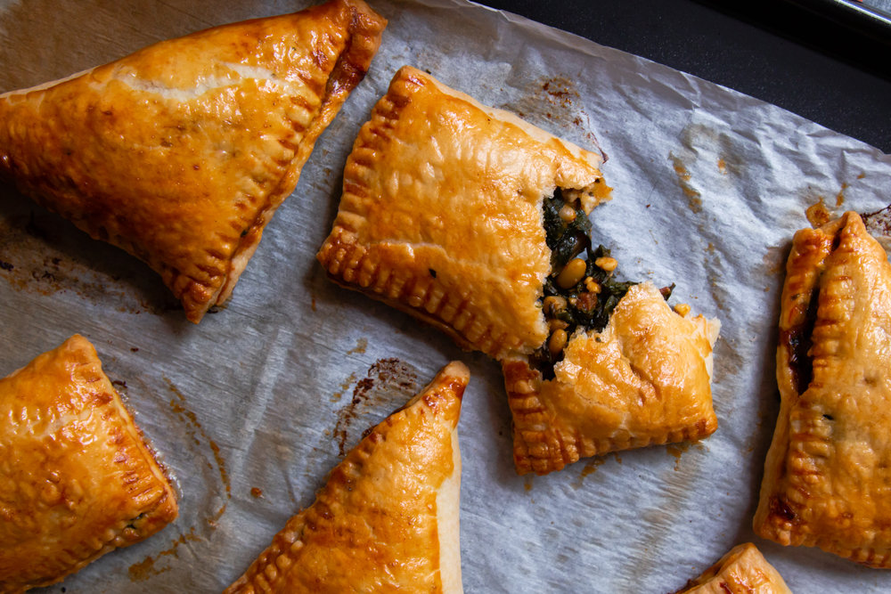

Bakoula is a Moroccan salad originally made with mallow however, you can alternatively make it with Swiss chard. In addition the feta and pine nuts are signature flavours of Morocco, is your mouth watering yet? These handmade pies are the perfect handheld snack or delicious ententrée for a Moroccan feast suitable for vegetarians!

*This Recipe Makes 6 Hand Pies.*

## Ingredients

* 320g ready-rolled shortcrust pastry sheets
* 1 egg, beaten to brush the pastry
* 2 tablespoons pine nuts
* 60g feta, crumbled
* ¼ teaspoon salt, or more to taste
* ½ teaspoon ground cumin
* 1 teaspoon paprika
* 2 tablespoons olive oil
* 400g Swiss chard, stalks removed, leaves cut into strips 3cm wide
* 2 tablespoons finely chopped flat-leaf parsley
* 1 tablespoon finely chopped fresh coriander
* 1 tablespoon lemon juice
* 2 garlic cloves, peeled and crushed

## Method

1. Preheat the oven to 220°C (200°C fan).
2. To make the bakoula salad, heat the olive oil in a large saucepan over medium-low heat. Add the Swiss chard and then stir in the remaining ingredients, except the feta and pine nuts. Cover the pan and cook for about 8 to 10 minutes until the chard is soft. Uncover the pan and cook for a further 5 minutes or until all the liquid has evaporated, stirring occasionally. Taste and adjust the seasoning, adding more salt if necessary. Remove the pan from the heat and stir in the feta and pine nuts. leave the filling to cool to room temperature, when you can start assembling the hand pies. Alternatively, transfer the filling to a bowl, cover with clingfilm and refrigerate until ready to use; it will keep for up to 2 days.
3. Unroll your pastry sheets on to a work surface and cut each sheet into squares or rectangles. Spoon about 4 tablespoons of the filling in the centre of each square/rectangle. Fold one corner over the filling to meet the opposite corner to form a triangle or a rectangle, then seal the edges by pressing down with the tines of a fork.
4. Place the turnovers on the lined baking tray, leaving about 2cm between them. Brush their tops with the beaten egg and bake for about 20 to 25 minutes until golden brown. Serve warm or at room temperature.

*Preparation time: 45 Minutes*