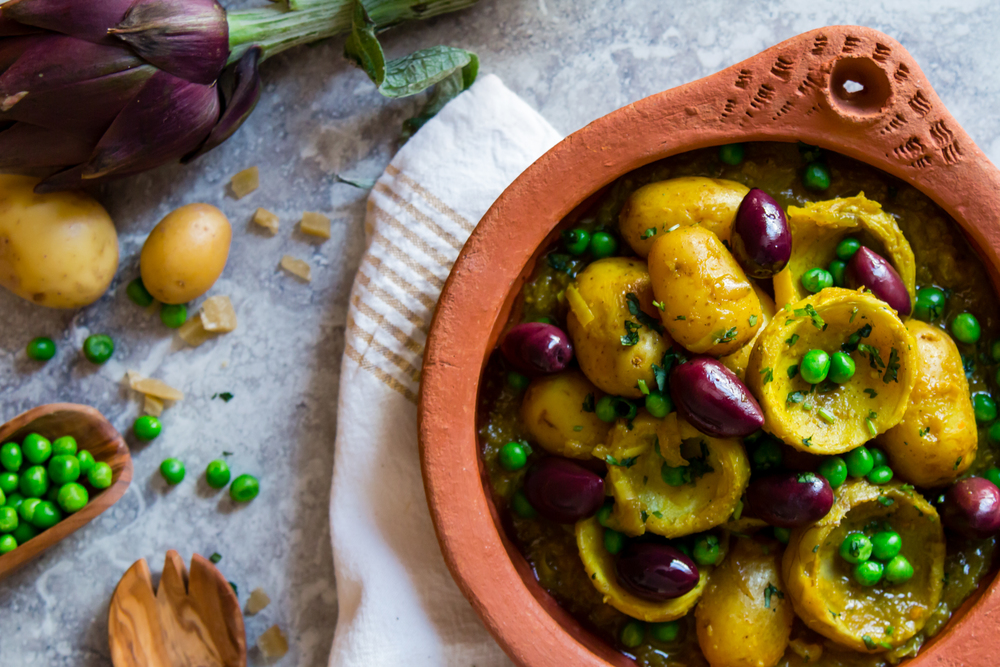

Traditionally artichoke tagine is prepared in Morocco with meat and green peas but I substituted the meat with baby potatoes in order to create a dish suitable for vegetarian or vegan guests. Plus potatoes and artichoke make a great match! This dish contains green peas, plenty of spices, olives, and preserved lemon. It's satisfying, fragrant, citrusy and is not hard to make.

*This recipe makes 4 dishes.*

## Ingredients

* 2 tablespoons olive oil
* 2 large onions chopped or sliced (400 gr)
* 2 teaspoons finely chopped garlic (about 2 to 3 cloves)
* ½ teaspoon ground turmeric
* ½ teaspoon ground dried ginger
* ¾ teaspoon salt or more to taste
* ¼ teaspoon ground black pepper
* 1 ½ to 2 cups vegetable stock (300 ml to 450 ml)
* 400 gr baby potatoes
* 1 medium-size preserved lemon
* 10 medium-size artichoke bottoms (600 gr)
* 200 gr green peas
* 150 gr red-brown olives, like kalamatas
* Chopped coriander for garnish

*Note: If Artichokes are out of season for you then try using frozen ones.*

## Method

1.  In a large casserole, heat the olive oil and add the onions over medium heat. Cover with a lid and leave the onions until they are soft and translucent for about 10 minutes. This will allow the onions to sweat.
2. Add the garlic, the spices, salt and pepper and 1 ½ cup (300ml) vegetable stock. Cover with a lid and leave to simmer gently for 30 minutes to obtain a nice broth.
3. Meanwhile, remove the flesh from the preserved lemon and finely chop the skin (discard the flesh).
4. Add the potatoes, the artichoke bottoms and the preserved lemon in the casserole and cover with a lid for 20 to 25 minutes until both the artichoke and the baby potatoes are nicely cooked and soft. At this stage, there should be enough liquid in the casserole to partially cover the potatoes and the artichokes, if it looks like the tagine is too dry, add more vegetable stock.
5. Add the green peas and cover for 3 to 4 minutes or until the green peas are cooked.
6. Serve warm with a side of couscous or crusty bread. Top with olives and freshly chopped coriander.

*Preparation time: 1 hour*