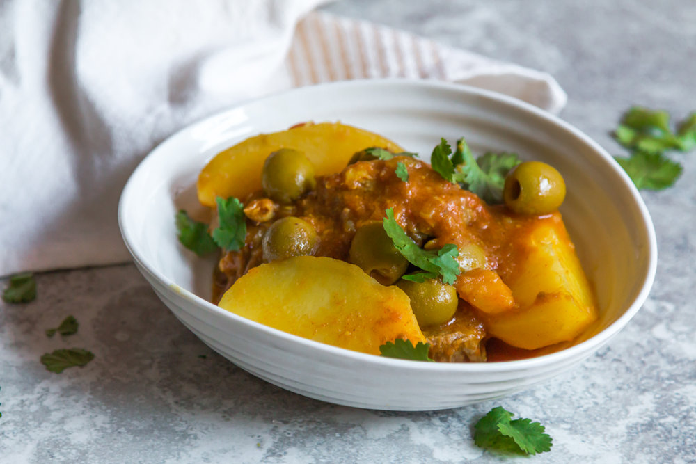

It doesn't get any more classic than a Lamb, Potato and Olive Tagine. Every Moroccan would have tried it at least once throughout the course of their life. Simple yet filling, this dish is easy to make and will satisfy your guests at the dinner table!  

*This recipe serves 6.*

## Ingredients

* 2 tablespoons olive oil 
* 1 large onion, sliced
* 3 garlic cloves, peeled and crushed
* 1,2 kg lamb neck fillets (or any type of stewing meat) trimmed and cut into 5 cm pieces
* 300 ml vegetable stock or water
* 3 tomatoes, grated
* 1 teaspoon turmeric
* 1 teaspoon ginger
* 1 teaspoon paprika
* ½ teaspoon cumin
* ½ teaspoon salt, or more to taste
* 1 kg potatoes, peeled in cut into wedges
* 200 gr green olives drained
* Chopped coriander for garnish

## Method

1. In a large saucepan, heat the olive oil and add the onions over medium heat. Cover with a lid and leave the onions until they are soft and translucent for roughly 10 minutes. This will allow sweating the onions. Once you’ve sweated the onions, add the garlic and the meat. Cook for 7 minutes turning the meat occasionally to lightly brown it.
2. Add in the vegetable stock or water, tomatoes, spices and salt and bring to the boil. Cover with a lid and reduce the heat to medium-low. Leave to simmer gently for 1h 30 to 2 hours or until the meat is almost cooked and separates easily. Stir occasionally. If at any point throughout cooking it looks like there are not enough liquids in the saucepan, add in a few tablespoons of water.
3. Add the potato wedges to the saucepan pushing them into the liquid and cover with a lid. Leave to simmer until the potatoes are soft and cooked, about 20 minutes. Uncover and transfer in the olives. Give a gentle stir to the content of the saucepan and simmer for 5 minutes. Taste and adjust the seasoning with salt if necessary. Serve immediately with bread. 

*Preparation time: 2 Hours 30 Minutes*