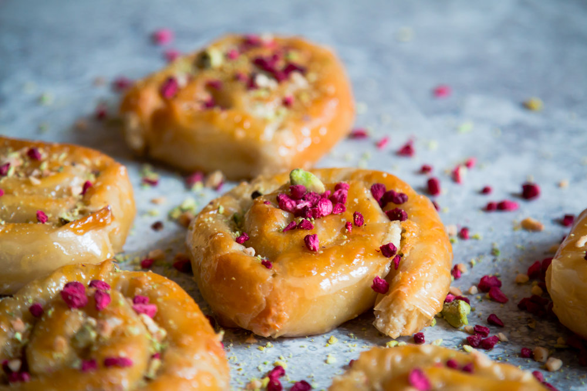

 In Moroccan Arabic, mhencha comes from the word hench which means serpent, so in a way, mhencha means serpentined. This cute pastry consists of a delicious almond paste tucked in a filo sheet, then rolled to form a swirling snake and finally dipped in simmering honey. 

*This recipe makes 8 mini mhenchas.*

## Ingredients

*For the Almond Paste:*

* 250 gr blanched almonds
* 120 gr caster sugar
* Pinch cinnamon
* Pinch salt
* 3 tablespoons orange blossom water
* 10 gr unsalted butter, softened

*To Roll the Pastry:*

* 8 sheets filo pastry, 20 x 30 cm (200 gr)
* 50 gr unsalted butter, melted
* 300 gr honey
* Groundnuts and freeze-dried berries for decoration (optional)

*Tip: The key to making a successful mhencha is to not break your filo pastry.  To avoid that, make sure to brush the filo sheet thoroughly with melted butter and not over-tighten the pastry the first time your roll it.*

## Method

1. Preheat the oven to 180 C (350 F)
2. Start with the almond paste, you will use it to fill the mhencha. Transfer the almonds and sugar to a nut grinder or a food processor and run until it becomes a moist paste. This will take a bit of time, about 5 minutes. Add in the orange blossom and butter and run again for a few seconds. Remove the paste and divide it into 8 equal parts. Shape each part into long tubes (approximately 30 cm) and cover with cling film.
3. Place a filo sheet on a work surface and brush it with melted butter (keep the other ones covered with a cloth to avoid drying out). Take an almond paste tube, place it on the long side of a filo pastry and loosely roll up the sheet. Don’t be tempted to over-tighten the pastry when rolling it because it will break during the baking process. Cover the rolled almond paste with more melted butter and roll it up to form a snug coil. Place the mhencha onto a lined baking sheet and repeat until you’ve used all the almond paste and filo sheets. Transfer in the warm oven until they are baked and lightly golden, about 15 minutes
4. Meanwhile, heat the honey in a small saucepan over medium heat. Avoid burning the honey by controlling the heat, once it’s foamy, you should reduce the heat.
5. Once the pastries are baked, immediately transfer to the simmering honey and soak for 2 minutes. You will have to do this in batches as all the pastries won’t fit in the pan.
6. Remove to a flat dish to cool before serving. Decorate with ground nuts and/or freeze-dried berries if desired.

*Preparation time: 25 Minutes.*