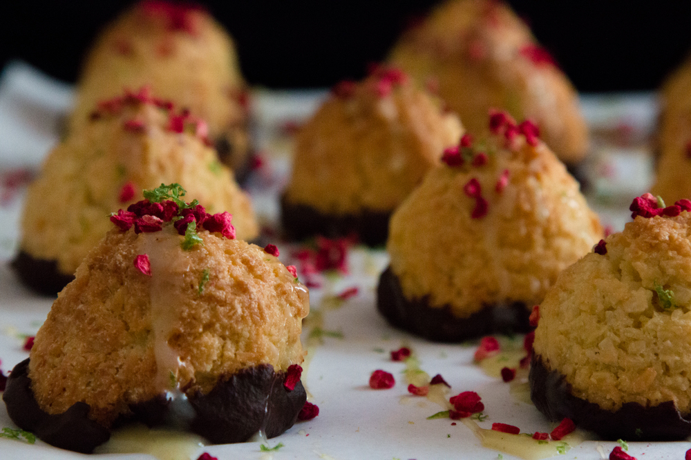
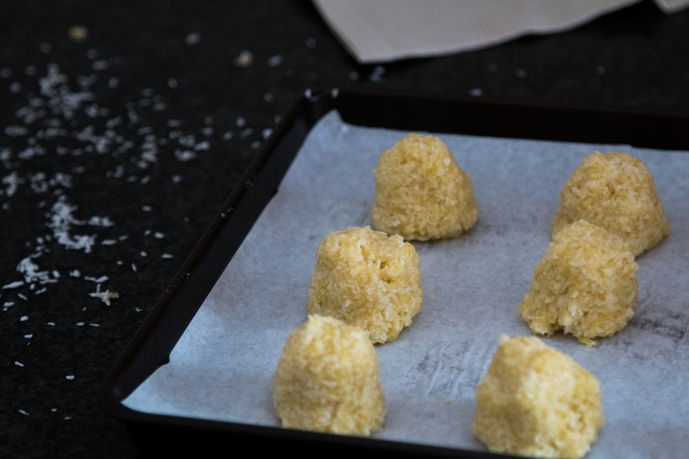

These macaroons have a very balanced citrusy, sweet and aromatic taste, but they are also super chewy on the inside and slightly crunchy on the outside, this recipe is gluten, dairy-free and suitable for vegetarians. The recipe is very straightforward and quick, but if you can, take an extra 15 minutes to decorate your macaroons with anything that makes you happy.  Decorating is always my favourite part, apart from eating, of course! I chose to use dark chocolate, white chocolate (non-dairy free), dried raspberries and lime zest to decorate my macaroons but use whatever you have available!

*This recipe makes 18 Macaroons.*

## Ingredients

* 250 gr desiccated coconut
* 130 gr icing sugar
* 100 gr ground almonds
* 1 teaspoon baking powder
* 1 teaspoon salt
* Zest of one lemon
* 3 eggs
* 40 ml olive oil
* 2 tablespoons orange blossom water
* 1 teaspoon vanilla extract
* Melted chocolate, dried berries, lime zest for decoration (optional)

## Method

1. Preheat oven to 180 C (350 F).
2. In a large bowl mix all the dry ingredients (desiccated coconut, icing sugar, ground almonds, baking powder, salt and lemon zest).
3. Separate the egg yolks from the egg whites and place the egg whites in a large bowl. In a medium-size bowl place the egg yolks, olive oil, orange blossom water and vanilla extract and stir with a fork until smooth. Use an electric whisk to beat the egg whites until stiff.
4. Pour the egg yolks, orange blossom water and olive oil mixture in the dry ingredients mixture and mix well until all the dry ingredients are wet. They won’t be very moist, at this stage your macaroon mixture will look like breadcrumbs. 
5. Using a large metal spoon (or your hands), gently and slowly insert the stiffed egg whites into the macaroon mixture.
6. Line a baking tray with baking paper. Using your hands shape the macaroons in the desired shape and size. I made small pyramids. 

   *Tip: When placing the macaroons on the baking tray, don’t forget to leave some space between each macaroon as they will become slightly bigger while baking.*
7. Place in the oven and bake for 17 to 20 min, until the macaroons have slightly cracked and are golden. Leave to cool down before removing the macaroons from the baking paper. 
8. Decorate with melted chocolate, dried fruits and citrus zest. 

   *Tip: Place the chocolate and a few drops of water in a microwave-safe bowl stopping and stirring at 15- second intervals until smooth and creamy.*

   

*Preparation time: 45 minutes.*