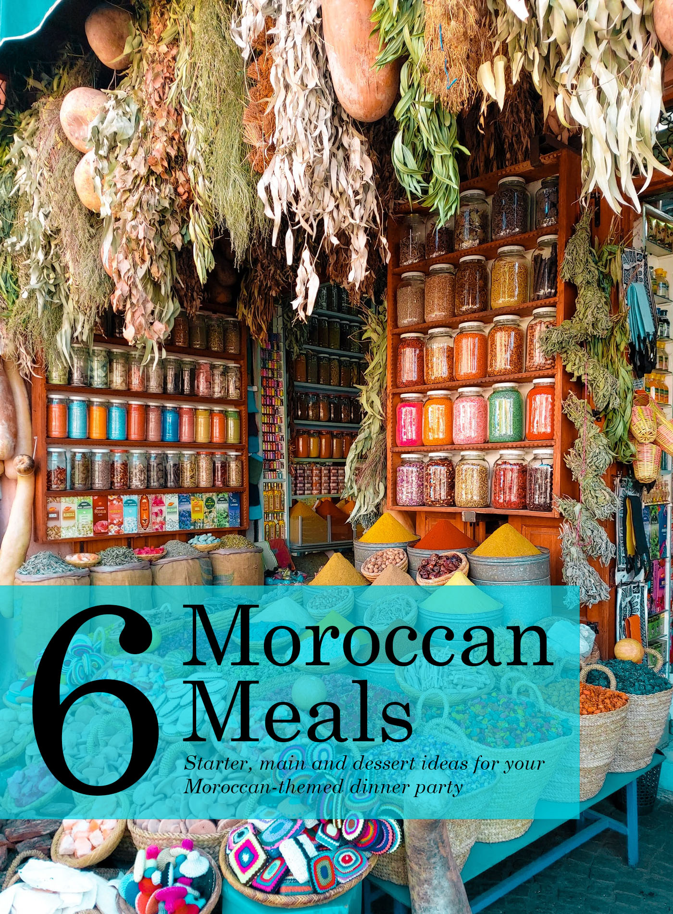

This ebook features a mix of six traditional and modern Moroccan dishes sectioned into three-course meal ideas with two starters, two mains and two desserts with a vegetarian alternative to suit your guest’s dietary requirements. This book is perfect for readers who want to throw their own Moroccan themed dinner party! All recipes have been adapted from Nargisse, the founder of [My Moroccan Food](http://www.mymoroccanfood.com/) and author of *Casablanca*. Alongside the recipes will be tips and tricks for cooking your perfect dish and where is best to source your ingredients. High-quality photographs will also be featured, showcasing ideas on how you can present your plates and food to your guests around the dinner table.

